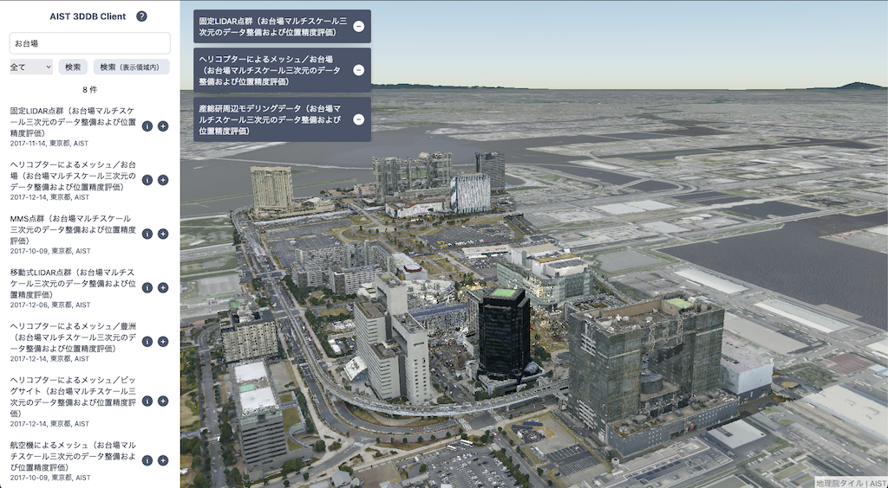

# AIST 3DDB Client

AIST 3DDB Client は、国立研究開発法人 [産業技術総合研究所](https://www.aist.go.jp/) (以後、産総研と呼称します) 情報・人間工学領域 デジタルアーキテクチャ研究センター [地理空間サービス研究チーム](https://www.digiarc.aist.go.jp/team/gsvrt/) が開発・運用・管理するデジタルツインプラットフォームである 3DDB システム向けに開発された Web アプリケーションです。

3DDB システムに登録されている様々な三次元データを検索・表示・ダウンロードすることができます。



当 Web アプリケーションは、[Apache License, Version 2.0](https://www.apache.org/licenses/LICENSE-2.0) の下に公開しており、当該ライセンスを順守すれば、どなたでも自由に利用することができます。

## 利用方法

当 Web アプリケーションの利用方法を以下に記します。

### 導入手順

導入手順を以下に記します。

当 Web アプリケーションの動作には、[Node.js](https://nodejs.org/) のバージョン 16 および [国土交通省 国土地理院](https://www.gsi.go.jp/) (以後、地理院と呼称します) が提供する GeoTiff ファイル (jp_gsi_gsigeo2011.tif) が必要となります。

1. 当 Web アプリケーションのソースツリーを取得します。

   `$ git clone https://github.com/aistairc/aist_3ddb_client`

1. Node.js の導入は、[こちら](https://github.com/nodejs/help/wiki/Installation) を参照してください。

   使用している OS 向けのパッケージが提供されている場合、パッケージによる導入でも問題ありません。

   開発時に利用した Node.js のバージョンは `v16.18.0`、[npm](https://www.npmjs.com/) のバージョンは `8.19.2` です。

1. GeoTiff ファイルの導入は、以下の URL より当該ファイルを取得します。

   [https:\/\/github.com\/OSGeo\/PROJ-data\/tree\/master\/jp_gsi](https://github.com/OSGeo/PROJ-data/tree/master/jp_gsi)

   取得後、取得したファイルを当 Web アプリケーションのソースツリー `public/proj` 以下にコピーしてください。

   **--- 注意事項 ---**

   **当 Web アプリケーションの公開環境での稼働もしくは、当 Web アプリケーションを用いた成果物を公開環境で稼働する場合、当該ファイルの利用について地理院の許諾を得る必要があります。**

1. 当 Web アプリケーションの動作に必要な関連ライブラリをインストールします。

   ```sh
   $ cd aist_3ddb_client
   $ npm install
   ```

これまでに記した内容の実行例を以下に記します。

```sh
$ cd ~
$ git clone https://github.com/aistairc/aist_3ddb_client
$ wget https://nodejs.org/dist/v16.18.0/node-v16.18.0-linux-x64.tar.xz
$ sudo -u root -i
# tar xf node-v16.18.0-linux-x64.tar.xz -C /usr/local
# export PATH="/usr/local/nodde-v16.18.0-linux-x64/bin:${PATH}"
# sudo npm install -g npm
# exit
$ export PATH="/usr/local/nodde-v16.18.0-linux-x64/bin:${PATH}"
$ cd ~
$ git clone https://github.com/OSGeo/PROJ-data.git
$ cp ~/PROJ-data/jp_gsi/jp_gsi_gsigeo2011.tif ~/aist_3ddb_client/public/proj
$ cd ~/aist_3ddb_client
$ npm install
```

### 起動手順

起動手順について以下に記します。

以下のコマンドにより起動します。

```sh
$ cd ~/aist_3ddb_client
$ npm run dev
```

起動後、Web ブラウザで `http://127.0.0.1:5173/` にアクセスすることで、当 Web アプリケーションの利用を開始します。

ホストやポートの変更が必要な場合、以下のオプションで変更することが可能です。

```sh
$ npm run dev -- --host=<任意のホスト名もしくは IP アドレス> --port=<任意のポート番号>
```

Apache 等の Web サーバにデプロイする場合、`aist_3ddb_client/vite.config.ts` の `base` の設定を、Web サーバでの公開時の URL に修正し、以下のコマンドを実行します。

```sh
$ cd ~/aist_3ddb_client
$ npm run build
```

実行完了後に `dist` ディレクトリ以下の内容をデプロイしてください。

### 操作方法

操作方法について以下に記します。

- 画面左側から、データの検索ができます。テキスト入力欄に「城」「お台場」「PLATEAU」などと入力し、検索ボタンを押すことで、該当する検索結果が一覧表示されます。

- デフォルトで「全て」が選択されているプルダウンメニューにより、データの種別で絞って検索できます（「点群」「Surface」「Structure」「CityGML」）。

- 「検索（表示領域内）」ボタンにより、現在地図画面で表示されているエリアに存在するものに絞って検索ができます。この時、画面に地平線（上空）が含まれると、表示領域が特定できなくなることに注意してください。

- 検索結果ごとの(i)アイコンをクリックすると、データの詳細がポップアップ表示されます。ダウンロードが許可されるデータではフォルダアイコンが表示され、これをクリックすることでダウンロードできます。

- 検索結果ごとの(+)アイコンをクリックすると、そのデータを地図上に表示できます。表示データは、地図画面左上にカードとして列挙され、その中にある(-)アイコンをクリックすることで削除できます。

- 地図画面では、左クリックとドラッグにより、移動することができます。右クリックとドラッグ、もしくはスクロールにより、ズームすることができます。中央ボタンとドラッグ、もしくは CTRL キーとドラッグにより、視点を傾けたり回転することができます。

## 利用データ

当 Web アプリケーションは、以下のデータを用いています。

- 3DDB API

  3DDB API のご利用における免責事項および利用条件は、[こちら](https://github.com/aistairc/aist_3ddb_client/blob/main/ABOUT_USE_3DDB_API.md) を参照してください。

- 国土地理院
  - 地理院タイル
    - 写真（ https://cyberjapandata.gsi.go.jp/xyz/seamlessphoto/{z}/{x}/{y}.jpg ）
    - 標高（https://cyberjapandata.gsi.go.jp/xyz/dem_png/{z}/{x}/{y}.png）
    - 参考: [地理院地図｜地理院タイル一覧](https://maps.gsi.go.jp/development/ichiran.html)
  - ジオイド高
    - `public/proj/jp_gsi_gsigeo2011.tif`
    - 参考: `public/proj/jp_gsi_README.txt`, [ジオイド・モデルの提供｜基盤地図情報ダウンロードサービス](https://fgd.gsi.go.jp/download/geoid.php)

## 実装

当 Web アプリケーションは、全体を[Vue.js](https://vuejs.org/)（v3, Composition API, script setup 構文）で実装しています。
地図およびレイヤー (地物) の表示処理は [CesiumJS](https://www.cesium.com/platform/cesiumjs/) を用いています。
実装には TypeScript を用いています。

以下に実装の詳細を記します。

### コンポーネント

`src/views/HomeView.vue` をもとに、その下に `src/components/`にある `LayerMenu.vue`、`MapPane.vue`、`DisplayedLayers.vue`というコンポーネントを設置しています。

#### LayerMenu

画面の左側に表示される、レイヤー（地物）の検索や選択を行うためのコンポーネントです。

3DDB API から、入力されたキーワードによりレイヤーを検索します。
3DDB API から情報を取得する処理は `src/modules/api.ts` に記載しています。

検索結果の(i)アイコンをクリックすることで、レイヤーの詳細情報を閲覧したり、ファイルをダウンロードすることのできるポップアップが表示されます。このポップアップに相当するコンポーネントは `src/components/InfoPopup.vue` です。

「検索（表示領域内）」ボタンでは、表示領域（地図画面に表示されているエリア）に存在するレイヤーのみを対象として検索します。表示領域は、描画画面の四隅から経緯度を取得することで特定しています。処理の詳細は `MapPane` コンポーネント内の `getViewerWKTPolygon()` 関数を参照してください。

#### MapPane

CesiumJS で地図およびレイヤー（地物）を表示するコンポーネントです。レイヤーの追加・削除を行う関数を定義しており、これらを`LayerMenu`および`DisplayedLayers`から用いて、選択レイヤーを操作しています。

#### DisplayedLayers

LayerMenu で選択されたレイヤーをカードとして表示するコンポーネントです。選択されたレイヤーは、地図上に描画されます。

### 地物の標高

地理院標高タイルをもとに、CesiumJS で 3D 地形を表示しています。地理院標高タイルの加工処理の詳細は `src/modules/gsiTerrain.ts` を参照してください。また、同等の処理がモジュールとして別途公開されています: [Kanahiro/cesium-gsi-terrain: Cesium で国土地理院の標高タイルを用いた地形表現を行うためのモジュール](https://github.com/Kanahiro/cesium-gsi-terrain)

上記の 3D 地形に加えて別途、地理院が提供する GeoTIFF ファイルをもとに、地物ごとのジオイド高を取得して設定しています。GeoTIFF ファイルは `public/jp_gsi_gsigeo2011.tif` に設定しています。GeoTIFF のジオイド高取得処理の詳細は `src/modules/utils.ts` にある `getGeoidHeight()` 関数を参照してください。

## 3DDB API

3DDB API について以下に記します。

3DDB API のご利用における免責事項および利用条件は、[こちら](https://github.com/aistairc/aist_3ddb_client/blob/main/ABOUT_USE_3DDB_API.md) を参照してください。

### データ種別取得

| メソッド | URI |
| --- | --- |
| GET | /api/v1/services |

- 概要
  - 3DDB システムが扱うデータセット (service_name) の一覧を取得します。

- URI パラメータ

  | パラメータ名 | データ型 | 指定例 | 説明 |
  | --- | --- | --- | --- |
  | type | string | 3D | データタイプ (2D もしくは 3D) を指定する。当該パラメータを省略した場合、全てのデータセットを返す。 |

  **注意: 現在 2D のデータは存在しないため、2D のデータセットに関する検索結果は、常に 0 件となります。**

- レスポンス
  - レスポンスの Content-TYpe は `Content-Type: application/json` です。
  - [HTTP レスポンスステータスコード](https://developer.mozilla.org/ja/docs/Web/HTTP/Status) が `200` でない場合はエラーです。 適宜エラー処理を実施してください。

- レスポンススキーマ

  ```
  {
    "$schema": "http://json-schema.org/draft-04/schema#",
    "type": "object",
    "properties": {
      "services": {
        "type": "array",
        "items": {
          "type": "object",
          "properties": {
            "id": {
              "type": "number"
            },
            "name": {
              "type": "string"
            },
            "type": {
              "type": "string",
              "description": "データタイプ(2D:2D, 3D:3D, ALL:ALL)"
            },
            "description": {
              "type": "string",
              "description": "詳細な説明"
            }
          },
          "required": [
            "id",
            "name",
            "type",
            "description"
          ]
        }
      }
    }
  }
  ```

### データ検索

| メソッド | URI |
| --- | --- |
| GET | /api/v1/services/{service_name}/features|

- 概要
  - 地物データを検索します。
  - 検索対象とするデータセット (service_name) を指定します。ALL を指定すると全てのデータセットが検索対象となります。
  - 各検索パラメータは AND 条件で検索されます。
  - レスポンスは GeoJSON 互換のフォーマットで返します。
  - レスポンスの上限 (ハードリミット) は 400 件です。

- URI パラメータ

  | パラメータ名 | データ型 | 指定例 | 説明 |
  | --- | --- | --- | --- |
  | reg_ids | string | 6,12,81 | 登録 ID のカンマ区切りのリストを指定する。 |
  | area | string | POLYGON((130 20, 130 10, 140 10, 140 20, 130 10)) | 検索範囲を指定する場合には経度緯度の POLYGON, POINT を記述する。(高さはminz, maxzで指定)また、地図座標が設定されていないデータを検索する場合には non を指定する。|
  | start | string | 2019-01-01T00:00:00Z | 検索開始時刻 (作成時刻) を指定する。 |
  | end | string | 2019-06-01T00:00:00Z | 検索終了時刻 (作成時刻) を指定する。 |
  | title | string | 3ddata | 地物のタイトルを検索対象とする。タイトルに含まれる文字列を指定する。 |
  | description | string | 3ddata description | 地物の詳細説明を検索対象とする。詳細説明に含まれる文字列を指定する。 |
  | author | string | AIST | データの作成者を検索対象とする。データの作成者に含まれる文字列を指定する。 |
  | string | string | AIST | 地物のタイトル・詳細説明・データの作成者を検索対象とする。 検索対象に含まれる文字列を指定する。 |
  | minz | number | 10.0 | 最低高度 (メートル) を指定する。 |
  | maxz | number | 20.0 | 最高高度 (メートル) を指定する。 |
  | limit | number | 100 | レスポンスの上限 (ソフトリミット) を指定する。 |
  | offset | number | 0 | レスポンスの開始位置 (0 オリジン) を指定する。 |

- レスポンス
  - レスポンスの Content-TYpe は `Content-Type: application/json` です。
  - [HTTP レスポンスステータスコード](https://developer.mozilla.org/ja/docs/Web/HTTP/Status) が `200` でない場合はエラーです。 適宜エラー処理を実施してください。

- レスポンススキーマ

  ```
  {
    "$schema": "http://json-schema.org/draft-04/schema#",
    "type": "object",
    "properties": {
      "type": {
        "type": "string"
      },
      "properties": {
        "type": "object",
        "properties": {
          "all": {
            "type": "number",
            "description": "検索数"
          },
          "num": {
            "type": "number",
            "description": "レスポンス数"
          }
        }
      },
      "features": {
        "type": "array",
        "items": {
          "type": "object",
          "properties": {
            "type": {
              "type": "string"
            },
            "geometries": {
              "type": "array",
              "items": {
                "type": "object",
                "properties": {
                  "type": {
                    "type": "string"
                  },
                  "coordinates": {
                    "type": "array"
                  },
                  "properties": {
                    "type": "object",
                    "properties": {
                      "file_id": {
                        "type": "string",
                        "description": "ファイル ID"
                      },
                      "minz": {
                        "type": "number",
                        "description": "最低高度(メートル)"
                      },
                      "maxz": {
                        "type": "number",
                        "description": "最高高度(メートル)"
                      }
                    }
                  }
                }
              }
            },
            "properties": {
              "type": "object",
              "properties": {
                "reg_id": {
                  "type": "number",
                  "description": "登録 ID"
                },
                "service_name": {
                  "type": "string",
                  "description": "データフォーマット名"
                },
                "creation_date": {
                  "type": "string",
                  "description": "データ作成開始日"
                },
                "creation_date_end": {
                  "type": "string",
                  "description": "データ作成終了日"
                },
                "registration_date": {
                  "type": "string",
                  "description": "データ登録/更新日時"
                },
                "title": {
                  "type": "string",
                  "description": "タイトル"
                },
                "description": {
                  "type": "string",
                  "description": "データの説明"
                },
                "author": {
                  "type": "string",
                  "description": "データ作成者"
                },
                "location": {
                  "type": "string",
                  "description": "所在地"
                },
                "group": {
                  "type": "string",
                  "description": "登録グループ"
                },
                "license": {
                  "type": "string",
                  "description": "ライセンス"
                },
                "downloadable": {
                  "type": "boolean",
                  "description": "3D データ(生データ)のダウンロード可否のフラグ。ダウンロード可能な場合には true、不可能な場合には false を設定。"
                },
                "3dtiles_url": {
                  "type": "string",
                  "description": "描画用データ(3DTiles)が存在する場合には、描画用データの URL が記述される。"
                },
                "external_link": {
                  "type": "string",
                  "description": "外部リンクへの参照 URL が存在する場合にはその URL、そうでない場合には null を設定。"
                },
                "external_link_type": {
                  "type": "string",
                  "description": "外部リンクの種類の名称が存在する場合にはその短縮名の文字列、そうでない場合には null を設定。"
                }
              },
              "required": [
                "reg_id",
                "service_name",
                "creation_date",
                "registration_date",
                "title",
                "description",
                "author",
                "location",
                "group",
                "license",
                "downloadable",
                "external_link",
                "external_link_type"
              ]
            }
          }
        }
      }
    }
  }
  ```

### データダウンロード

| メソッド | URI |
| --- | --- |
| GET | /api/v1/zipdata/{reg_id}|

- 概要
  - 地物データをダウンロードします。ダウンロード対象とするデータの登録 ID (reg_id) を指定します。
  - レスポンスは ZIP データを返します。

- レスポンス
  - [HTTP レスポンスステータスコード](https://developer.mozilla.org/ja/docs/Web/HTTP/Status) が `200` でない場合はエラーです。 適宜エラー処理を実施してください。

## ライセンス

Copyright 2023, National Institute of Advanced Industrial Science and Technology (AIST).

Licensed under the Apache License, Version 2.0 (the "License"); you may not use this file except in compliance with the License.

You may obtain a copy of the License at [http:\/\/www.apache.org\/licenses\/LICENSE-2.0](http://www.apache.org/licenses/LICENSE-2.0)

Unless required by applicable law or agreed to in writing, software distributed under the License is distributed on an "AS IS" BASIS, WITHOUT WARRANTIES OR CONDITIONS OF ANY KIND, either express or implied.

See the License for the specific language governing permissions and limitations under the License.

## 謝辞

- 当 Web アプリケーションは [新エネルギー・産業技術総合開発機構（NEDO）](https://www.nedo.go.jp/) プロジェクト [「人工知能技術適用によるスマート社会の実現（空間の移動)」](https://www.nedo.go.jp/activities/ZZJP_100137.html) の一環として開発しました。
  この場を借りて深く御礼申し上げます。

- 当 Web アプリケーションの開発は [株式会社 MIERUNE](https://www.mierune.co.jp/) により実施されました。

<!--
@copyright Copyright 2023, National Institute of Advanced Industrial
           Science and Technology (AIST).

@author Digital Architecture Research Center, Geoinformation Service
        Research Team.

        https://www.digiarc.aist.go.jp/en/team/gsvrt/

@license Licensed under the Apache License, Version 2.0 (the "License");
         you may not use this file except in compliance with the License.

         You may obtain a copy of the License at

           http://www.apache.org/licenses/LICENSE-2.0

         Unless required by applicable law or agreed to in writing, software
         distributed under the License is distributed on an "AS IS" BASIS,
         WITHOUT WARRANTIES OR CONDITIONS OF ANY KIND, either express or
         implied.
         See the License for the specific language governing permissions and
         limitations under the License.
-->
